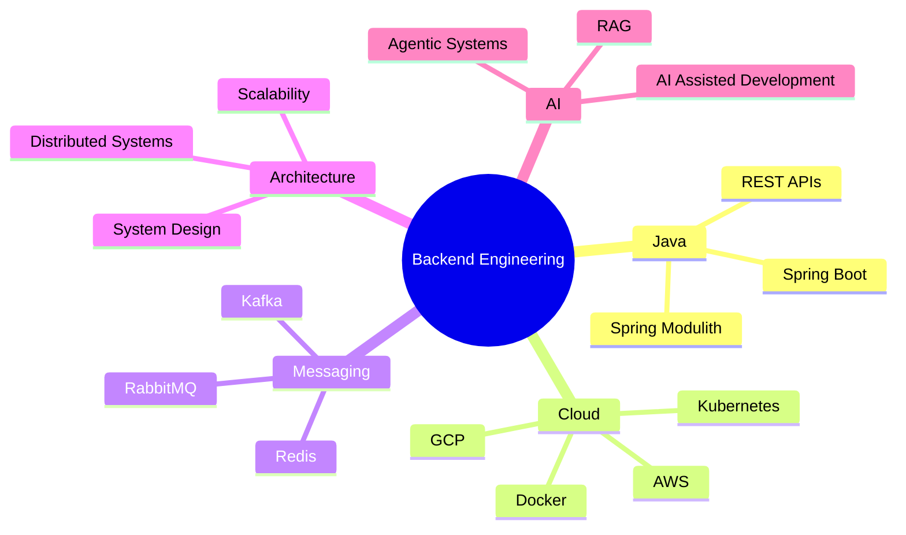
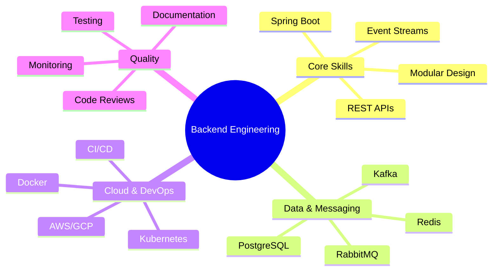
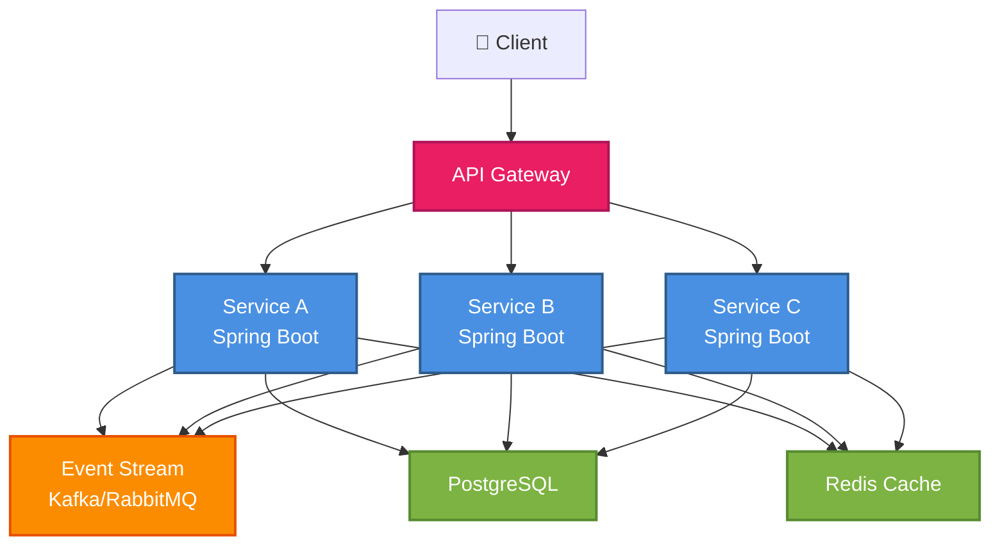
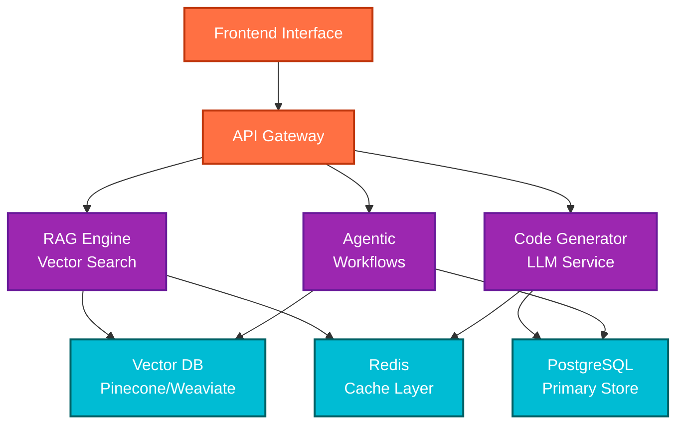
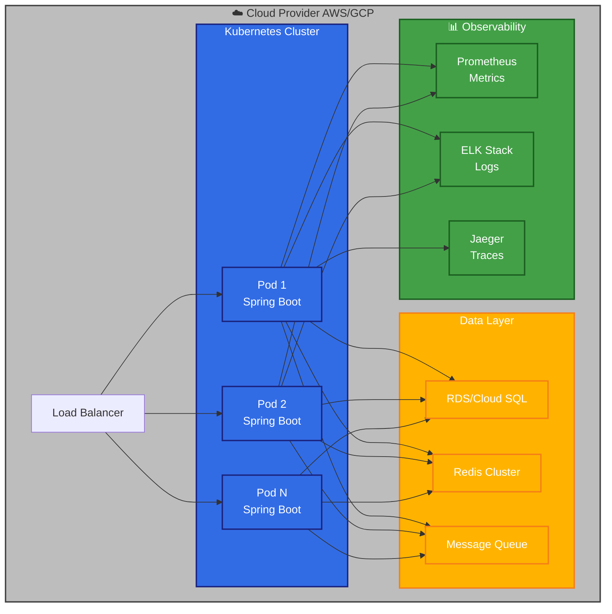
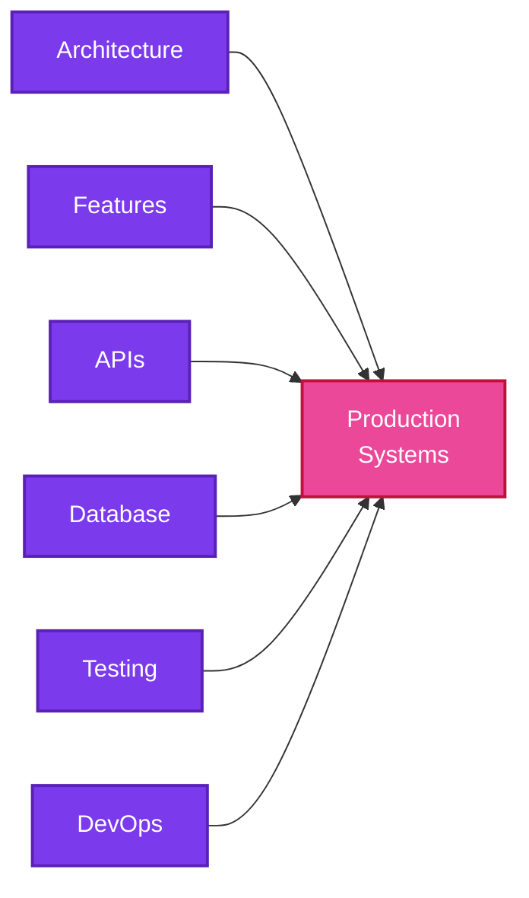

# Hi 👋, I'm Vineet Kundu

<h3 align="center">
Backend Engineer @ Novatek Solutions
</h3>

<p align="center">
Java • Spring Boot • Distributed Systems • Cloud Native Applications • AI-Assisted Development
</p>

<p align="center">

</p>

---

## 💼 Engineering Profile

<p align="center">


</p>

---

## 🖥️ whoami

```
vineet@backend-engineer:~$ whoami
┌──────────────────────────────────────────────────────────┐
│                  VINEET KUNDU                            │
├──────────────────────────────────────────────────────────┤
│ Role              : Backend Engineer                     │
│ Company           : Novatek Solutions                    │
│ Focus             : Production Systems & Architecture    │
├──────────────────────────────────────────────────────────┤
│ Core Expertise:                                          │
│ ├─ Spring Boot & Spring Modulith                        │
│ ├─ Distributed Systems & Microservices                  │
│ ├─ Event-Driven Architecture (Kafka, RabbitMQ)          │
│ ├─ Cloud Native (AWS, GCP, Kubernetes)                  │
│ ├─ RAG Pipelines & AI-Assisted Development              │
│ └─ Database Architecture & Optimization                 │
├──────────────────────────────────────────────────────────┤
│ Current Mission:                                         │
│ Building scalable, event-driven systems that power      │
│ real-world applications. Bridging backend engineering   │
│ with AI-powered workflows for next-gen development.     │
└──────────────────────────────────────────────────────────┘
```

---

## 🚀 About Me

Backend Engineer focused on building production-grade applications using modern software engineering practices.

Currently working at **Novatek Solutions**, where I contribute to real-world products using Spring Boot, Spring Modulith, cloud-native architecture, event-driven systems, and AI-powered workflows.

---

## 🌐 Connect With Me

<p align="center">

<a href="https://linkedin.com/in/vineet-kundu-b83407218">

</a>

<a href="https://github.com/KunduVineet">

</a>

<a href="https://t.me/helipack">

</a>

<a href="mailto:kunduvineet6@gmail.com">

</a>

<a href="https://leetcode.com/u/VineetKundu">

</a>

</p>

---

## 🎯 Current Mission

```
building:
├── Production Backend Systems
│   └── High-performance, scalable services
├── Spring Modulith Applications
│   └── Modular, maintainable architectures
├── Event-Driven Architectures
│   └── Kafka/RabbitMQ based systems
├── AI-Powered Developer Workflows
│   └── RAG pipelines & agentic systems
└── Cloud Native Services
    └── Kubernetes, Docker, AWS/GCP
```

---

## 🏗 Engineering Mindset



---

## 🛠 Tech Stack

### Backend

<p align="center">

</p>

### Cloud & DevOps

<p align="center">

</p>

### Frontend

<p align="center">

</p>

### Tools

<p align="center">

</p>

---

## 💼 Production Engineering Experience



---

## 🚀 Engineering Projects & Case Studies

### 📦 Event-Driven Microservices



---

### 🤖 AI-Assisted Development Platform



---

### 🏗️ Scalable Backend Infrastructure



---

## 🏆 Production Applications

### 🏋️ [DOKAZ](https://play.google.com/store/apps/details?id=com.dokaz) - Fitness Ecosystem

```
╔═══════════════════════════════════════════════════════════╗
║                     DOKAZ FITNESS                         ║
╠═══════════════════════════════════════════════════════════╣
║ Status   : 🟢 PRODUCTION                                  ║
║ Platform : Google Play Store                              ║
║ Users    : Real-world Production Users                    ║
║ Role     : Backend Engineer & API Developer               ║
╠═══════════════════════════════════════════════════════════╣
║ Tech Stack:                                               ║
║ • Spring Boot       • REST APIs                           ║
║ • PostgreSQL        • Redis Caching                       ║
║ • Docker            • Cloud Deployment                    ║
║ • JWT Authentication • Payment Integration                ║
╠═══════════════════════════════════════════════════════════╣
║ Contributions:                                            ║
║ ✓ Backend Architecture & API Development                 ║
║ ✓ Database Design & Optimization                         ║
║ ✓ Authentication & Security Implementation               ║
║ ✓ Performance Tuning & Scalability                        ║
║ ✓ Production Monitoring & Incident Response              ║
╠═══════════════════════════════════════════════════════════╣
║ Download: [Google Play Store](https://play.google.com/)  ║
║           com.dokaz                                       ║
╚═══════════════════════════════════════════════════════════╝
```

<p align="center">
<a href="https://play.google.com/store/apps/details?id=com.dokaz">

</a>
</p>

---

<p align="center">


</p>

---

## 🔥 Streak & Activity

<p align="center">

</p>

<p align="center">

</p>

<p align="center">

</p>

---

## 💡 Highlights

Building scalable systems with **Spring Boot** • **Kubernetes** & **Docker** • **RAG pipelines** • Distributed architecture • Cloud-native development

---

## 🔒 Private Repository Work



---

## 🎯 Current Focus

Advanced Kubernetes • LLM optimization • Graph databases • Observability & SRE • Distributed systems

---

<h3 align="center">
Code • Learn • Build • Scale 🚀
</h3>

<p align="center">
  <sub>Always interested in discussing backend architecture, distributed systems, and AI integration. Let's build something amazing.</sub>
</p>
