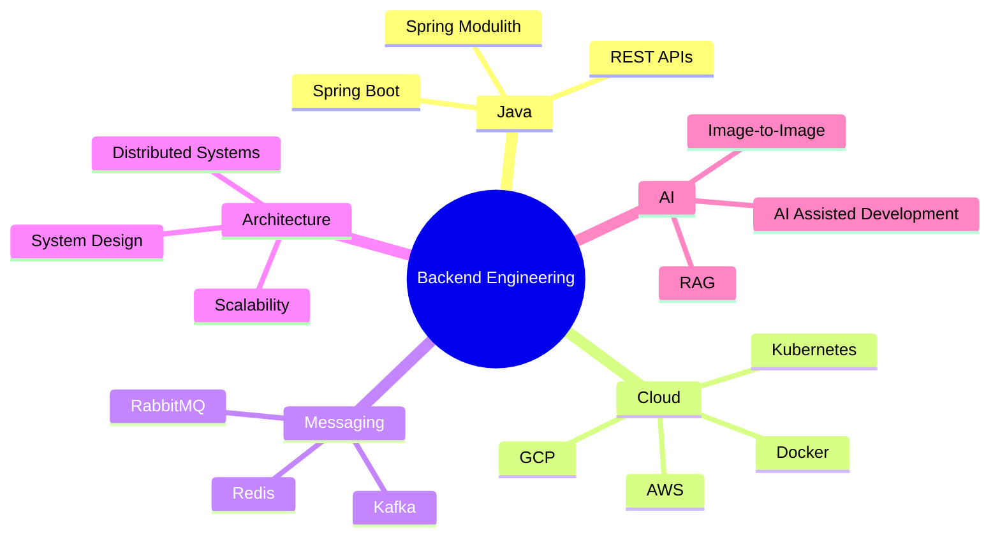

# Hi 👋, I'm Vineet Kundu

<h3 align="center">
Backend Engineer @ Novatek Solutions
</h3>

Java • Spring Boot • Distributed Systems • Cloud Native Applications • AI-Assisted Development

---

## 🚀 About Me

I'm a Backend Engineer focused on building production-grade applications using modern software engineering practices.

Currently working at **Novatek Solutions**, where I contribute to real-world products using Spring Boot, Spring Modulith, cloud-native architecture, event-driven systems, and AI-powered workflows.

### Current Areas of Focus

* Backend Engineering
* Spring Boot & Spring Modulith
* Microservices & Distributed Systems
* Cloud Architecture (AWS & GCP)
* AI-Assisted Development
* RAG Applications
* System Design

---

## 🌐 Connect With Me

---

## 🏗 Engineering Mindset

---

## 🛠 Tech Stack

### Backend

### Cloud & DevOps

### Frontend

### Tools

---

## 💼 Production Engineering Experience

### Backend Development

* Spring Boot Applications
* Spring Modulith Architecture
* RESTful API Design
* Modular System Design
* Event-Driven Architecture

### Messaging & Data

* Apache Kafka
* RabbitMQ
* Redis
* PostgreSQL
* MySQL

### DevOps & Delivery

* Docker Containerization
* Kubernetes
* AWS Services (EC2, S3, RDS, IAM)
* GCP
* Multi-Environment Deployments

### Engineering Practices

* Liquibase Database Migrations
* Extensive Unit & Integration Testing
* API Documentation
* Technical Documentation
* CI/CD Pipelines
* Code Reviews
* Agile Development

### Environment Strategy

* Development
* Testing
* Staging
* Production

---

## 🚀 Featured Work

### 🏋️ DOKAZ Fitness Platform

Production-grade fitness application available on Google Play.

Key Contributions:

* Backend Development
* API Development
* Database Integration
* Feature Implementation
* Production Bug Resolution
* Engineering Collaboration

Play Store:

https://play.google.com/store/apps/details?id=com.dokaz

---

### 🏥 Healthcare Platform (In Development)

Currently contributing to a healthcare-focused platform involving:

* Scalable Backend Services
* Cloud-Native Architecture
* Secure Data Processing
* Modular Design
* Production Engineering Practices

Status: Under Active Development

---

## 📊 GitHub Analytics

---

## 🔥 Contribution Streak

---

## 📈 Contribution Activity

---

## 📋 GitHub Summary

---

## 💡 Professional Highlights

* Building production applications at Novatek Solutions
* Contributed to the DOKAZ fitness ecosystem
* Working on healthcare platform development
* Experience with Spring Modulith architecture
* Experience with event-driven systems
* Cloud-native development practices
* AI-assisted engineering workflows
* Strong focus on maintainability and documentation

---

## 🔒 Private Repository Contributions

A significant portion of my work is performed within private repositories and internal products.

Areas of contribution include:

* Backend Architecture
* Feature Development
* System Design
* API Development
* Database Design
* Testing Strategy
* Technical Documentation
* Deployment Workflows
* Production Support

---

## 🚀 Future Enhancements

Planned profile improvements:

* GitHub Metrics Dashboard
* Contribution Snake Animation
* Automated Activity Tracking

These will eventually replace the summary-card section and provide a more advanced developer profile experience.

---

<h3 align="center">

Code • Learn • Build • Scale 🚀

</h3>
