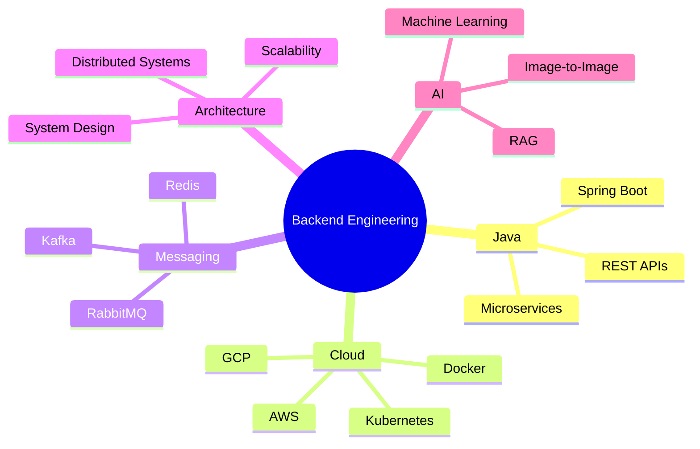
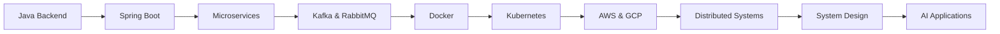

# Hi 👋, I'm Vineet Kundu

<h3 align="center">
Backend Engineer • Java & Spring Boot Developer • Cloud & Distributed Systems Enthusiast
</h3>

<p align="center">
Building scalable backend systems, cloud-native applications, and AI-powered solutions.
</p>

<p align="center">
  <a href="https://komarev.com/ghpvc/?username=KunduVineet">
    
  </a>
</p>

---

## 🚀 About Me

<table>
<tr>
<td width="60%">

* 💼 Software Developer at **Novaluna Technologies**
* 🔭 Building **Spring Boot Microservices**
* 🌱 Learning **Kubernetes, Cloud Architecture, AI/ML**
* 🤝 Open to collaborating on Backend & AI projects
* 💬 Ask me about **Java, Spring Boot, Kafka, RabbitMQ, Redis**
* ⚡ Passionate about scalable systems and distributed architecture

</td>

<td width="40%">


</td>
</tr>
</table>

---

## 🌐 Connect With Me

<p align="center">

<a href="https://linkedin.com/in/vineet-kundu-b83407218">

</a>

<a href="https://github.com/KunduVineet">

</a>

<a href="https://t.me/helipack">

</a>

<a href="mailto:kunduvineet6@gmail.com">

</a>

<a href="https://leetcode.com/u/VineetKundu">

</a>

</p>

---

## 🛠 Tech Stack

### Backend & Architecture

<p align="center">

</p>

### Cloud & DevOps

<p align="center">

</p>

### Frontend

<p align="center">

</p>

### Development Tools

<p align="center">

</p>

---

## ⚡ Engineering Interests

<p align="center">


</p>

---

## 🏗 Engineering Mindset



---

## 📊 GitHub Analytics

<p align="center">


</p>

---

## 🔥 Contribution Streak

<p align="center">

</p>

---

## 📈 Contribution Activity

<p align="center">

</p>

---

## 📋 GitHub Summary

<p align="center">

</p>

---

## ☁️ Current Learning Path



---

## 🚀 Featured Domains

| Domain              | Technologies                      |
| ------------------- | --------------------------------- |
| Backend Development | Java, Spring Boot, JPA, Hibernate |
| Distributed Systems | Kafka, RabbitMQ, Redis            |
| Cloud Computing     | AWS, GCP                          |
| Containerization    | Docker, Kubernetes                |
| Frontend            | React, TypeScript                 |
| AI Engineering      | RAG, Image-to-Image Synthesis, ML |

---

## 🎯 Professional Focus

```text
Backend Engineering
Cloud Native Development
Microservices Architecture
Distributed Systems
AI-Powered Applications
System Design
```

---

<p align="center">

</p>

---

<h3 align="center">

Code • Learn • Build • Repeat 🚀

</h3>
